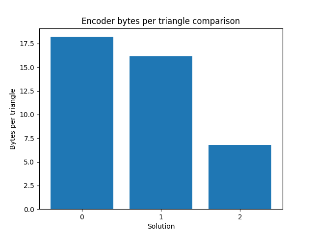
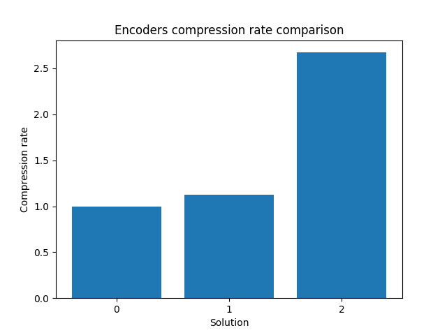

# MeshPress

MeshPress is a 3D mesh compression library that offers various encoding techniques to reduce the storage size of 3D models. The project aims to provide efficient compression of 3D meshes while preserving the geometric integrity of the models. This is especially useful in applications such as graphics rendering, AR/VR, and game development where memory efficiency and loading times are critical.

## Features

- Multiple encoding techniques with varying levels of compression efficiency.
- Ability to choose different packing strategies to optimize for space.
- Statistics on compression performance (bytes per triangle and bytes per vertex).

## Installation

To use MeshPress, clone the repository and install any dependencies. The project is compatible with Python 3.x and requires standard scientific libraries (e.g., NumPy).

```bash
git clone https://github.com/maletsden/meshpress.git
cd meshpress
pip install -r requirements.txt
```

## Compression Models

The following table summarizes the statistics for each compression model:


| Encoder Model                                                | Bytes per triangle | Bytes per vertex | Compression rate | 
|--------------------------------------------------------------|--------------------|------------------|------------------|
| **BaselineEncoder**                                          | 18.05              | 35.82            | 1.00             |
| **SimpleQuantizator (no packing)**                           | 11.60              | 23.03            | 1.56             | 
| **SimpleQuantizator (fixed packing)**                        | 5.77               | 11.46            | 3.13             | 
| **SimpleQuantizator (binary range partitioning)**            | 5.69               | 11.29            | 3.17             |
| **SimpleQuantizator (radix binary tree)**                    | 5.59               | 11.09            | 3.23             | 
| **SimpleQuantizator (binary range partitioning, reordered)** | 5.62               | 11.15            | 3.21             |
| **SimpleQuantizator (radix binary tree, reordered)**         | 5.54               | 11.00            | 3.26             | 
| **GTSQuantizator (fixed packing)**                           | 4.82               | 9.57             | 3.74             |
| **GTSQuantizator (radix binary tree)**                       | 4.70               | 9.32             | 3.84             | 
| **PackedGTSQuantizator (fixed packing)**                     | 4.26               | 8.46             | 4.23             |
| **PackedGTSQuantizator (radix binary tree)**                 | 4.18               | 8.29             | 4.32             | 
| **GTSParallelogramPredictor (Huffman encoder)**              | 4.94               | 9.81             | 3.65             |
| **GTSParallelogramPredictor (adaptive Huffman encoder)**     | 4.92               | 9.77             | 3.67             |
| **GTSParallelogramPredictor (arithmetic encoder)**           | 4.92               | 9.77             | 3.67             |
| **GTSParallelogramPredictor (adaptive arithmetic encoder)**  | 4.90               | 9.73             | 3.68             |
| **SimpleEllipsoidFitter(0.0005, 3)**                         | 4.34               | 8.61             | 4.16             |
| **SimpleEllipsoidFitter(0.0005, 4)**                         | **4.16**           | **8.26**         | **4.34**         |

Each encoder model applies a different strategy for compressing 3D mesh data, allowing users to balance compression rate and computational complexity according to their needs.

 

## License

This project is licensed under the MIT License. See the `LICENSE` file for details.

## Contributing

Contributions are welcome! Please open an issue or submit a pull request if you have improvements or suggestions.

