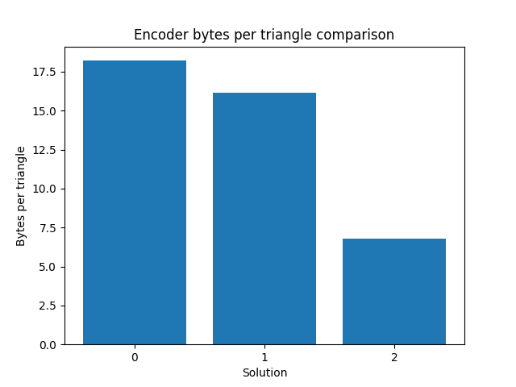
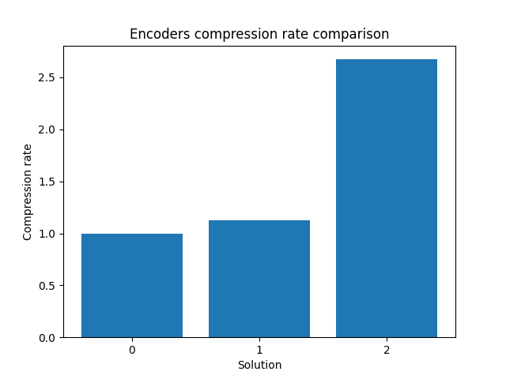

# MeshPress

MeshPress is a 3D mesh compression library for real-time GPU decompression. It extends the AMD GPUOpen meshlet compression approach with segmented delta vertex encoding, achieving **24% better compression** while maintaining crack-free rendering and GPU-parallel decode.

## Features

- **Crack-free** meshlet compression via global quantization grid
- **GPU-parallel** decompression using GTS strip decode (countbits/firstbithigh intrinsics)
- **Segmented delta** vertex encoding: 24% smaller vertices than AMD baseline
- Controlled precision: guaranteed maximum reconstruction error
- Scales to millions of polygons (tested on 1.8M vertex models)

## Installation

```bash
git clone https://github.com/maletsden/meshpress.git
cd meshpress
pip install -r requirements.txt
pip install scikit-learn cupy-cuda12x  # for meshlet encoders and GPU benchmarks
```

## Quick Usage

```python
from reader import Reader
from encoder import MeshletGTSSegDelta, MeshletGTSPlain

model = Reader.read_from_file('assets/stanford-bunny.obj')

# Our best: GTS connectivity + segmented delta vertices (crack-free, GPU-parallel)
encoder = MeshletGTSSegDelta(max_verts=256, precision_error=0.0005, verbose=True)
compressed = encoder.encode(model)

# AMD baseline: GTS connectivity + plain quantized vertices (crack-free, GPU-parallel)
encoder = MeshletGTSPlain(max_verts=256, precision_error=0.0005, verbose=True)
compressed = encoder.encode(model)
```

## Compression Benchmarks

All encoders use **AMD GTS connectivity** (Generalized Triangle Strip with L/R flags + inc/reuse packing, ~6 bpt, GPU-parallel decode via bit intrinsics). The difference is vertex encoding only.

### Full Pipeline (GTS connectivity + vertices, max_error=0.0005)

| Model | Verts | Tris | AMD Baseline BPV | SegDelta BPV | Haar BPV | SegDelta Improvement |
|-------|------:|-----:|-----------------:|-------------:|---------:|---------------------:|
| bunny | 2,503 | 4,968 | 47.34 | **41.53** | 42.28 | +12.3% |
| torus | 3,840 | 7,680 | 56.48 | **39.07** | 38.56 | +30.8% |
| stanford-bunny | 35,947 | 69,451 | 37.90 | **32.49** | 34.47 | +14.3% |
| Monkey | 504,482 | 1,007,616 | 41.54 | **31.69** | 33.77 | +23.7% |

All crack-free (0 shared vertex mismatches verified). 100% within error target.

### Bits Breakdown (Monkey, GTS+SegDelta)

| Component | Size | % | BPV | Description |
|-----------|-----:|--:|----:|-------------|
| Headers | 117 KB | 5.9% | 1.86 | Global + per-meshlet metadata |
| Vertex data | 1,083 KB | 54.2% | 17.18 | Segmented delta encoded |
| Connectivity | 798 KB | 39.9% | 12.66 | GTS: L/R flags + inc/reuse |
| **Total** | **1,998 KB** | **100%** | **31.69** | **9.1x compression** |

### Vertex Encoding Comparison (vertex data only, same GTS connectivity)

| Method | S-Bunny | Monkey | vs Plain | GPU Parallel |
|--------|--------:|-------:|---------:|:-------------|
| Plain (AMD baseline) | 104 KB | 1,704 KB | — | Trivial (just read) |
| **Segmented Delta** | **80 KB** | **1,083 KB** | **-36%** | **32 independent prefix sums** |
| Haar Wavelet | 89 KB | 1,215 KB | -29% | log(N) steps, 6 syncs |
| CDF 5/3 Wavelet | 91 KB | 1,228 KB | -28% | log(N) steps, 6 syncs |

Segmented delta gives the best compression AND the fastest GPU decode: 32 independent segments decoded via prefix sum (2 syncs total vs 6 for wavelets).

### GPU Decode Speed (RTX 3090, isolated timing)

| Kernel | Stanford-Bunny (36K) | Monkey (504K) |
|--------|---------------------:|------------------:|
| AMD GTS+Plain (baseline) | 11.2 µs | 36.7 µs |
| **GTS+SegDelta Opt v3 (ours)** | **9.8 µs** | **44.3 µs** |
| GTS+Haar Opt v3 (ours) | ~10 µs | ~45 µs |

Our segmented delta adds only **+21% decode overhead** on large meshes vs the plain AMD baseline, while providing **24% better compression**. On small meshes it's actually faster.

## Architecture

### Encoding Pipeline
```
Mesh → Global Quantization (crack-free integer grid)
     → Meshlet Generation (greedy region growing, max 256 verts)
     → Per meshlet:
         BFS vertex ordering (spatial locality for delta encoding)
         GTS strip generation (L/R flags + inc/reuse packing)
         Vertex encoding: segmented delta on globally-quantized integers
     → Compressed stream
```

### Per-Meshlet Compressed Format
```
┌── Meshlet Header (37 bytes)
│   n_verts, n_tris, per-channel: base_min, base_bits, delta_min, delta_bits
├── GTS Connectivity
│   L/R flags:     1 bit per triangle (which edge reused)
│   Inc flags:     1 bit per strip entry (new vertex vs reused)
│   Reuse buffer:  uint8 per reused vertex (local index)
├── Vertex Data (per channel x,y,z)
│   Base stream:   32 anchor values × base_bits
│   Delta stream:  (n_verts-32) deltas × delta_bits
└── GPU decode: countbits + firstbithigh for connectivity
               32 parallel prefix sums for vertices
```

### GPU Decode (1 CUDA block per meshlet, 256 threads)
```
Phase 1: Read header (1 thread → broadcast)               [1 sync]
Phase 2: GTS connectivity decode (parallel, bit intrinsics) [0 syncs]
Phase 3: Vertex base values (32 threads)                    [1 sync]
Phase 4: Segment prefix sums (96 parallel: 32 segs × 3 ch) [1 sync]
Phase 5: Global dequantize + write output (parallel)        [0 syncs]
Total: 3 __syncthreads
```

### Crack-Free Guarantee

All vertices are quantized to a **global integer grid** at encode time. The segmented delta encoding is **lossless on integers** (prefix sum exactly reconstructs the original sequence). Shared boundary vertices in different meshlets get the **same integer code** → identical float reconstruction → zero cracks.

## Running Benchmarks

```bash
# Full encoder comparison on all models
python test_final_benchmark.py

# CUDA GPU decode speed benchmark (requires CuPy)
python benchmark_cuda_decode.py

# Wavelet/delta comparison
python test_wavelet_meshlet_compression.py

# Connectivity encode/decode verification
python test_connectivity_verify.py
```

## Available Encoders

| Encoder | Connectivity | Vertices | Crack-free | GPU Decode |
|---------|-------------|----------|:----------:|:----------:|
| `MeshletGTSSegDelta` | GTS | Segmented delta | **Yes** | **Parallel** |
| `MeshletGTSHaar` | GTS | Haar wavelet | **Yes** | Parallel |
| `MeshletGTSPlain` | GTS | Plain quantized | **Yes** | **Parallel** |
| `MeshletWaveletGlobalEB` | EdgeBreaker | Int wavelet | **Yes** | Sequential |
| `MeshletPlainAMD` | Raw packed | Global grid | **Yes** | Parallel |

## Legacy Encoders (vertex-only, bunny model)

| Encoder Model | Bytes/tri | Bytes/vert | Ratio |
|---------------|----------:|-----------:|------:|
| BaselineEncoder | 18.05 | 35.82 | 1.00 |
| PackedGTSQuantizator (radix) | 4.18 | 8.29 | 4.32 |
| PackedGTSEllipsoidFitter(0.0005, 4) | **2.75** | **5.47** | **6.55** |

 

## License

This project is licensed under the MIT License. See the `LICENSE` file for details.

## Contributing

Contributions are welcome! Please open an issue or submit a pull request.
