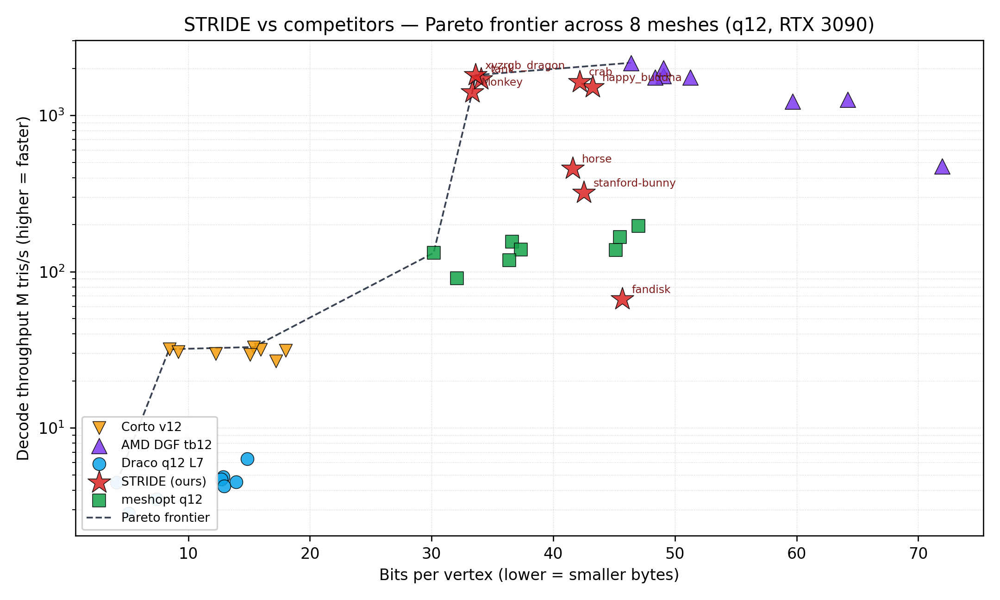
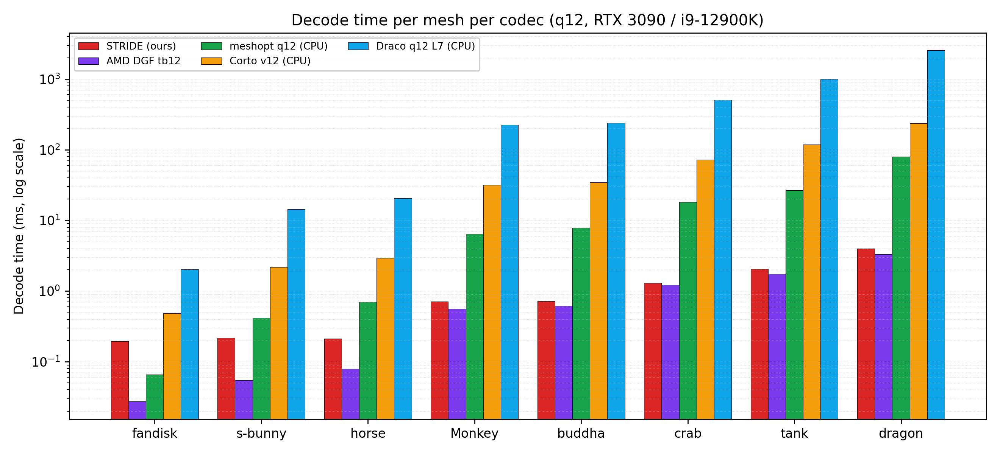

# STRIDE: STRIp-walked Triangulated Residual Integer Decoder for Per-Meshlet GPU Mesh Compression

*Target venue: The Visual Computer (Springer). This document is a content draft; formatting (svjour3, BibTeX, figure placement) is deferred to camera-ready.*

*v6 (2026-05-25): editorial pass over v5. Abstract trimmed to under 250 words, three-regime taxonomy consolidated to a single occurrence, §4.1 reduced to a parallelism summary, "structural" terminology varied, two §6.4 items reframed as open research questions, URL-only references annotated. Related Work expanded with additional citations across connectivity, prediction, entropy, and surveys. DGF throughput framing clarified (43 M tris/s is end-to-end meshlet rendering; 1.5–2.2 G tris/s is isolated decode).*

---

## Authors and affiliations

**Denys Maletskyi**¹ (corresponding) · **Yaroslav Vyklyuk**¹ · **Fengping Li**²

¹ Lviv Polytechnic National University, Lviv, Ukraine
² Zhejiang Lab for Regenerative Medicine, Zhejiang Province, China

| Author | Email | ORCID |
|---|---|---|
| Denys Maletskyi | denys.y.maletskyi@lpnu.ua | [0009-0003-1685-0472](https://orcid.org/0009-0003-1685-0472) |
| Yaroslav Vyklyuk | vyklyuk@ukr.net | [0000-0003-4766-4659](https://orcid.org/0000-0003-4766-4659) |
| Fengping Li | fpli@ojlab.ac.cn | [0000-0002-8535-112X](https://orcid.org/0000-0002-8535-112X) |

---

## Abstract

This paper presents **STRIDE** (STRIp-walked Triangulated Residual Integer Decoder), a mesh compression format designed for per-frame GPU decompression that emits vertex and index buffers consumable directly by modern mesh-shader pipelines. STRIDE is fully *per-meshlet self-contained*: every meshlet stores all of its own vertices inline, with boundary vertices duplicated across the meshlets that share them. Any individual meshlet can therefore be decoded in isolation, with no whole-mesh pre-pass. This random-access property is the same one offered by AMD's Dense Geometry Format (DGF) [1]. The proposed bitstream composes four design elements: (i) meshlets sized to the limits of contemporary mesh-shader APIs (at most 256 vertices and 256 triangles per cluster); (ii) packed-local-index connectivity following the AMD GTS / DGF layout; (iii) a single bounding-box-relative 12-bit per-axis integer quantization of the whole mesh, chosen to match the precision budgets of Draco q12 and DGF tb12; and (iv) an integer-rational linear predictor (IRLP), of which the classical parallelogram is a bit-exact special case, combined with per-axis adaptive Rice / Exp-Golomb residual coding and axis-separated residual substreams that enable three-way parallel decoding. The decoder is a single fused GPU kernel that assigns one warp-sized thread group to each meshlet. Benchmarked against DGF on an Ampere-class GPU, STRIDE attains a strictly smaller compressed size on every mesh in the evaluation corpus (between 1.38× and 1.93× smaller) at a decode throughput within 6–17 % of DGF on million-triangle inputs.

**Keywords:** mesh compression · meshlet · GPU decode · parallelogram prediction · real-time rendering

---

## 1. Introduction

Modern real-time renderers organise geometry into *meshlets*: small clusters of at most 256 vertices and 256 triangles that the GPU culls and shades through dedicated mesh-shader pipelines. The clustered representation is now a first-class abstraction in mainstream graphics APIs and is the input format consumed by AMD's hardware-supported Dense Geometry Format (DGF) [1]. A compressed format that is *meshlet-native*, i.e., whose decode unit is a single meshlet, inherits every benefit of this pipeline: per-frame GPU decompression without main-memory round-trips, throughput parity with raw mesh-shader execution, per-cluster culling, and the possibility of holding geometry on the GPU in its compressed form so that the per-frame off-chip bandwidth is paid by *visibility* rather than by *size*.

The current state of the art occupies three distinct regions of this design space.

- **Whole-mesh entropy coders.** Draco [2] and Corto [10] reach the smallest raw bits per vertex through a combination of Edgebreaker connectivity coding [4], parallelogram prediction [5], and arithmetic or range coding. Both decoders are sequential, CPU-resident, and operate at 4–32 M triangles per second; neither supports random access at a sub-mesh granularity.
- **Load-time byte-aligned coders.** meshoptimizer [3] employs byte-aligned codes that decode on the CPU at approximately 150 M triangles per second, after which the resulting raw vertex and index buffers are uploaded to the GPU. The scheme is excellent for one-shot loading but is not a per-frame GPU technique and does not provide random access.
- **Per-frame GPU coders.** AMD's DGF [1] is the first documented GPU-decode format aimed explicitly at per-frame use, with random access at the granularity of fixed-size (≤ 128-byte) blocks. AMD's published reference reports approximately 43 M triangles per second on consumer AMD hardware at approximately 49 bits per vertex [9]. That figure measures *end-to-end meshlet rendering*, i.e., decode together with the subsequent rasterisation pass, rather than isolated decode throughput. Our re-implementation of the published decode specification, instrumented to measure decode alone and run on a commodity NVIDIA RTX 3090, reaches 1.5–2.2 G triangles per second (§5.3). The two figures answer different questions and are not directly comparable; the decode-only figure is the relevant comparand for STRIDE's measurements.

STRIDE is designed for the same *per-meshlet self-contained, per-frame GPU-decode* regime as DGF. Its goal is twofold: (a) to close the byte gap, since DGF spends approximately 46–72 BPV due to its 128-byte block-alignment padding, while (b) remaining inside the same decode-throughput envelope on identical hardware.

**Contributions.** STRIDE is best characterised as a *system design*: four carefully chosen ingredients composed into a meshlet-native bitstream that decodes in a single fused GPU kernel at over 1.8 G triangles per second, and that emits buffers in the layout expected by modern mesh-shader pipelines. Each individual ingredient draws on prior work where appropriate; the contribution lies in the composition and in the end-to-end behaviour it yields:

1. **Mesh-shader-sized meshlet partitioning** (§3.2). A learned scoring function jointly weighs boundary count, surface area, and normal variance during greedy region growing, yielding an approximately 2.1 bits-per-vertex reduction over a baseline greedy partitioner on Stanford bunny while remaining inside the 256-vertex / 256-triangle bound. The packed-local-index connectivity layout of AMD GTS / DGF is adopted unchanged.
2. **Per-meshlet self-contained vertex layout with duplicated boundaries** (§3.3). Every meshlet stores all of its integer-quantized vertices inline. Boundary vertices are physically replicated in each meshlet that references them (with a measured vertex-replication factor of 1.16–1.79× depending on the partitioner), but no whole-mesh table is required at decode time and any meshlet can be reconstructed in isolation. This is the same property that makes DGF random-access; STRIDE pays a small bytes penalty for it in exchange for matching the DGF decode interface.
3. **Global integer lattice with an integer parallelogram predictor** (§3.4–§3.5). The mesh is quantized once onto a single integer lattice; interior vertices are predicted using the classical $\mathbf{a} + \mathbf{b} - \mathbf{c}$ parallelogram rule applied directly on the integer lattice. The prediction is bit-exact, contains no floating-point arithmetic inside the predictor, and requires no per-mesh weight fitting. Strip-root vertices that lack a parallelogram context (the "delta" vertices) are predicted from the immediately preceding decoded vertex.
4. **Axis-separated, axis-parallel residual coding** (§3.6, §4.3). The x, y, and z residual streams of each meshlet are written as three independent Rice / Exp-Golomb substreams rather than being interleaved on a per-vertex basis. The decoder assigns one execution lane per axis: three lanes execute the same Rice decode loop in lockstep on three independent bit cursors. The cost is five 16-bit per-meshlet sub-offsets in a side table (approximately 0.4 % of total bytes), and the benefit is the elimination of most of the per-vertex serial bottleneck.

A single fused GPU kernel (§4) maps this bitstream onto mesh-shader-ready buffers, processing one meshlet per thread group, fully parallel across meshlets, with serial connectivity decode on one lane, three-lane parallel axis-residual decode, and full-warp parallel position emission. Benchmarked on identical hardware (§5.3), STRIDE delivers a strictly smaller compressed size than DGF on every mesh (between 1.38× and 1.93× smaller) at decode throughput within 6–17 % of DGF on million-triangle inputs.

---

## 2. Related Work

Triangle-mesh compression has a thirty-year history spanning connectivity coders, geometric predictors, entropy back-ends, clustering strategies, and, more recently, GPU-decodable formats. This section reviews the prior art along each axis on which STRIDE makes a design choice, with comparison surveys [14, 15] cited at the end for a broader account.

### 2.1 Connectivity coding

Connectivity codecs fall into three lineages. The first, *topological surgery* [16], compresses a mesh by progressively cutting it along a spanning tree of vertices and a spanning tree of triangles; it underpinned the MPEG-4 BIFS 3D mesh tool but is rarely used today owing to its sequential decode and complex traversal. The second, *region-growing valence coding* [17, 18], emits per-vertex valences along a moving boundary and reaches the per-vertex entropy bound on regular meshes. The third lineage, dominant in current systems, is **Edgebreaker** [4], which emits one of five CLERS opcodes per triangle relative to a moving gate. Edgebreaker is provably bounded above by 1.84 bits per triangle and attains approximately 1.5 bits per triangle in entropy-coded form on typical manifold meshes, roughly four times smaller than the packed-local-index alternatives discussed below. The Cut-Border Machine of Gumhold and Straßer [19] is a closely related single-pass coder that arose contemporaneously. The price of the CLERS lineage is strict sequentiality: the gate state following triangle $i$ depends on triangle $i-1$. Single-thread GPU implementations are bounded by this dependency at roughly 100 M triangles per second on Ampere-class hardware; published parallel variants (wavefront EB, Gumhold-style region splits) recover some throughput but still pay a per-region synchronisation cost.

A separate line of work pre-packs *local* indices for parallel decoding: triangle strips [20] and the more recent **AMD GTS** layout (the predecessor of DGF) pre-pack each triangle's three local vertex indices into a 32-bit word that unpacks trivially in parallel. The cost is an additional approximately 5–6 bits per triangle of overhead, in exchange for full independence between triangles at decode time. DGF inherits this packed-local-index design.

STRIDE adopts the AMD GTS / DGF layout unchanged: we implement the published packed-local-index encoding with no algorithmic modifications at this layer. The decision is deliberate. Edgebreaker would shrink the connectivity section by approximately 4×, which (per §5.4) would reduce the total bitstream by nearly half; however, designing a parallel Edgebreaker decoder that fits within a single thread group per meshlet while retaining the streaming advantage of the GTS layout remains open work and is deferred to §6.3.

### 2.2 Vertex prediction

The classical *parallelogram predictor* of Touma and Gotsman [5] estimates a new vertex $\mathbf{v}$ as $\mathbf{a} + \mathbf{b} - \mathbf{c}$, where $(\mathbf{a}, \mathbf{b}, \mathbf{c})$ are the vertices of the previous triangle. Geometrically, this is the fourth corner of the parallelogram that completes the source triangle.

Generalising the rule to a free linear combination $\hat{\mathbf{v}} = w_0 \mathbf{a} + w_1 \mathbf{b} + w_2 \mathbf{c}$ is well studied: Isenburg and Alliez [6] apply parallelogram prediction across polygon faces and reduce the predictor's susceptibility to non-planarity; Cohen-Or et al. [7] propose multi-way weighted variants; Mamou et al. [8] adopt a weighted multi-parallelogram form in MPEG-4 SC3DMC; Draco extends [5] with degree-weighted multi-parallelogram; and Devillers and Gandoin [12] together with Krivograd et al. [13] fit per-mesh regression weights to similar effect. Sorkine et al. [21] reformulate the prediction problem in the spectral / Laplacian-coordinate domain. The free linear form is no longer a parallelogram once $(w_0, w_1, w_2) \ne (1, 1, -1)$; more generally, it is a weighted sum of three vertex coordinates.

STRIDE uses the canonical $(1, 1, -1)$ predictor by default and offers an *integer-rational linear predictor* (IRLP), described in §3.5, as an optional encoder-side optimisation. The IRLP fits per-mesh integer weights against the encoder's actual cost, falls back to canonical weights on a per-axis basis whenever the fit fails to improve cost, and is bit-exact on the integer lattice. The canonical parallelogram is recovered as the special case $(n_0, n_1, n_2, K) = (1, 1, -1, 0)$ of the IRLP family, so the decoder applies a single unconditional formula in both modes.

### 2.3 Entropy coding

Three families of variable-length entropy coders are in widespread use in mesh compression. *Adaptive arithmetic coding* [22] and *range coding* [23] approach the Shannon limit at the cost of strictly sequential decoding; both underpin Draco's positional-residual back-end. **Asymmetric Numeral Systems** (ANS) and the streaming variant rANS [24] retain the compactness of arithmetic coding while admitting table-driven decode steps; rANS is the workhorse of Draco's recent releases. *Length-prefix codes* (Huffman, Rice [25], and Exp-Golomb [26]) are coarser than arithmetic coding, sitting one to two bits per symbol above the source entropy, but decode in O(1) operations per code on hardware that exposes a count-leading-zeros instruction or its equivalent. meshoptimizer [3] relies on Huffman-style byte-aligned codes that admit vectorised CPU decoding. DGF uses bit-packed fixed-width residuals together with a per-block exponent that determines the residual width.

STRIDE employs *per-stream selectable codes*: each meshlet independently selects, for each axis, the best of fixed-width, Rice, or Exp-Golomb. The 2-bit tag and 4-bit parameter together cost approximately six bits per axis per meshlet. The resulting selection sits approximately 20–30 % above the per-stream Shannon entropy, which is coarser than arithmetic coding but decodable by a single logarithmic-prefix operation per Rice or Exp-Golomb code; the latter property is what makes the warp-parallel decoder feasible. The substreams are axis-separated, so three independent bit cursors decode in lockstep across three lanes of a single thread group (§4.3).

### 2.4 Mesh clustering and vertex ordering

The clustering step is upstream of compression. Three lineages are relevant. The first, *vertex-cache-aware reordering* [27, 28], reorders triangles so that recently emitted vertices are reused, raising rasteriser cache hit rates and indirectly improving strip-based predictors. The second, *geometry-aware clustering*, partitions a mesh into spatially compact regions for either rendering (mesh shaders) or compression: greedy region-growing, tunneling [11], and the SAH-block packer of DGF [1] all fall here. The third, *learned* partitioners, optimise a clustering objective against a measured downstream loss; STRIDE's joint-learned generator (§3.2) belongs in this category.

We compared three generators directly: greedy region-growing, tunneling [11], and the joint-learned scoring function. The learned generator combined with multi-seed strip ordering gives the lowest bits per vertex across the corpus (Figure 2, Table 1 in §3.2). DGF's bake step also performs cluster-aware reordering through a surface-area-heuristic block packer; we have not measured DGF when its bake step is fed the clusters used by STRIDE.

### 2.5 Other formats and surveys

Several mesh-compression systems target operating points outside the per-frame GPU-decode regime that STRIDE addresses. OpenCTM [29] applies floating-point quantization followed by LZMA and reaches small bytes for archival use, but its decode is sequential and host-side. The glTF Draco extension [30] embeds Draco bitstreams inside glTF assets, inheriting Draco's compression and decode profile. *Geometry images* [31] re-parametrise a mesh onto a 2-D texture domain and then compress the result with image codecs; the approach achieves excellent compression on simply connected models at the cost of a non-trivial parametrisation step. Progressive and multiresolution coders [32, 33] support level-of-detail streaming but are not aimed at single-pass GPU decode. Recent industrial systems, most prominently Unreal Engine's *Nanite* virtualised geometry [34], incorporate GPU-decoded clustered representations but are documented only through high-level descriptions. Surveys by Peng et al. [14] and Maglo et al. [15] provide broader treatments of the field up to roughly 2015.

The directly comparable per-frame GPU-decode format is therefore DGF, which is taken up quantitatively in §5.

---

## 3. Method

This section formalises STRIDE end-to-end. §3.1 lays out the encoder pipeline. §3.2 partitions the mesh into meshlets and fixes the global quantization grid. §3.3 specifies the per-meshlet self-contained vertex layout. §3.4 generates strips and binds them to a strip-emit traversal that the decoder can replay without a sidecar. §3.5 describes the packed-local-index connectivity stream and the integer-rational linear predictor. §3.6 codes per-axis residuals as axis-separated substreams.

### 3.1 Pipeline overview

The encoder applies four shared stages followed by per-meshlet emission (Figure 1).

![STRIDE-dup encoder pipeline overview. Four shared linear stages produce the final bitstream: meshlet partitioning (§3.2), global integer quantization (§3.2), strip walk with anchor/delta/IRLP vertex classification (§3.3 + §3.4), and the per-meshlet packer that writes the GTS connectivity stream plus three axis-separated residual substreams (§3.5–§3.6). The optional per-mesh IRLP fit (§3.5, dashed sidecar) runs once at encode time and ships a 21-byte `(n, K)` header into the global section; the decoder applies a single formula whether `(n, K)` is the canonical $(1, 1, -1)/0$ or fitted weights. STRIDE-dup has no global boundary table: every meshlet is self-contained, so there is no boundary/interior split.](figs/pipeline.png){width=100%}

### 3.2 Meshlet partitioning and global integer quantization

The mesh is partitioned into meshlets under the hard constraints $|M_{\text{verts}}| \le 256$ and $|M_{\text{tris}}| \le 256$, both matching the per-meshlet limits of contemporary mesh-shader pipelines.

The *joint-learned generator* treats partitioning as greedy region growing under a learned scoring function. Starting from an unassigned seed triangle, the generator expands the current cluster $M$ by repeatedly admitting the candidate boundary triangle $t$ that minimises

$$\mathcal{C}(M \cup \{t\}) = \alpha\,|M_\text{verts}| + \beta\,|M_\text{bnd}| + \gamma\,A(M) + \delta\,\mathrm{Var}(\mathbf{n}_M), \tag{1}$$

where $|M_\text{bnd}|$ is the number of vertices already shared with another meshlet (the dominant cost in our bitstream), $A(M)$ is the surface area of the cluster, and $\mathrm{Var}(\mathbf{n}_M)$ is the variance of triangle normals within $M$ (favouring near-planar clusters, which give the parallelogram predictor more leverage). The coefficients $(\alpha, \beta, \gamma, \delta)$ are learned by gradient descent against the encoder's measured bits per vertex as the loss, on a 12-mesh training corpus that is *disjoint* from the evaluation corpus of §5.

![Meshlet partitions on Stanford bunny under three generators (left to right: greedy region-grow, tuned tunneling [11], ours). The joint-learned generator produces 364 well-shaped clusters versus 500 for greedy and 272 for tuned tunneling.](figs/meshlet_compare_stanford-bunny.png){width=100%}

Figure 2 contrasts the three generators on Stanford bunny. The learned generator produces fewer but more uniformly shaped clusters, which simultaneously reduces vertex replication and shortens per-meshlet strip chains.

**Quantitative comparison.** Table 1 quantifies the same comparison on three meshes spanning the §5 corpus (small organic, CAD-like, large organic). In addition to the meshlet-count and shape signals of Figure 2, it reports cluster-cap utilisation (`T util%`), the vertex-replication factor $V_{\text{repl}} = (\sum V_{\text{per}}) / V_{\text{unique}}$, the median per-meshlet bounding-box aspect ratio, the share of cluster vertices that are referenced by at least one other meshlet (`Bnd%`), and the resulting STRIDE bits per vertex.

| Mesh | Gen | #M | V mean | T mean/max | T util% | Strips/M | V repl | Aspect | Bnd% | BPV |
|---|---|---:|---:|---:|---:|---:|---:|---:|---:|---:|
| s-bunny | greedy | 500 | 89 | 139 / 256 | 54 | **5.22** | 1.24 | 2.3 | 63.3 | 32.29 |
| s-bunny | tunneling (packed) | **272** | **220** | **255 / 256** | **100** | 8.24 | 1.66 | **2.1** | 78.1 | 42.32 |
| s-bunny | ours | 364 | 117 | 191 / 256 | 75 | 6.23 | **1.19** | **2.1** | **48.6** | **30.78** |
| tank | greedy | 21,362 | 102 | 164 / 256 | 64 | **5.60** | 1.22 | 4.0 | 44.9 | 37.99 |
| tank | tunneling (packed) | **13,695** | **174** | **256 / 256** | **100** | 9.51 | 1.33 | 5.7 | 47.7 | 40.93 |
| tank | ours | 18,409 | 112 | 190 / 256 | 74 | 6.10 | **1.16** | **3.5** | **33.7** | **37.13** |
| dragon | greedy | 58,287 | 82 | 124 / 256 | 48 | 5.18 | 1.32 | 2.3 | 68.9 | 49.78 |
| dragon | tunneling (packed) | **28,245** | **229** | **256 / 256** | **100** | **4.31** | 1.79 | 4.5 | 84.9 | 65.96 |
| dragon | ours | 33,193 | 133 | 217 / 256 | 85 | 7.45 | **1.22** | **1.9** | **43.1** | **46.44** |

**Table 1.** Meshlet-generator comparison on three representative meshes from the §5 corpus. `#M` is total meshlet count; `V mean` and `T mean/max` are vertices and triangles per meshlet; `T util%` is `T mean / 256`; `Strips/M` is mean disjoint strips inside each cluster after the multi-seed strip stage; `V repl` is the vertex-replication factor (avg meshlets a unique vertex appears in); `Aspect` is the *median* longest/shortest meshlet bbox-axis ratio; `Bnd%` is the mean share of cluster vertices referenced by another meshlet. Best per mesh in bold.

Three observations follow. (i) Tunneling attains full cluster-cap utilisation, but the resulting strips do not share vertices, so vertex replication rises to 1.33–1.79× and the boundary fraction remains high. Each of these effects translates directly into a bitstream cost. (ii) Greedy region-growing is moderate on every column but loses to the learned generator on meshlet count, cap utilisation, vertex replication, and boundary fraction simultaneously. (iii) The learned generator attains the lowest BPV on every mesh by jointly maximising cap utilisation (74–85 %) and minimising boundary fraction (33–49 %).

Following partitioning, the entire mesh is quantized once onto a global integer lattice. STRIDE uses *bounding-box-fractional per-axis quantization* at a fixed bit budget $b$ (default $b = 12$, matching Draco q12, meshopt q12, and AMD DGF tb12 for like-for-like comparison). Given the mesh axis-aligned bounding box $[\mathbf{g}_{\min}, \mathbf{g}_{\max}]$, every axis uses the same bit width $b$ and the per-axis step is

$$\Delta_d = (g_{\max,d} - g_{\min,d}) / (2^b - 1). \tag{2}$$

Each input vertex $\mathbf{v} \in \mathbb{R}^3$ becomes integer coordinates $\mathbf{q} \in \mathbb{Z}^3$ via

$$q_d = \Big\lfloor \tfrac{v_d - g_{\min,d}}{g_{\max,d} - g_{\min,d}} \cdot (2^{b} - 1) + \tfrac{1}{2} \Big\rfloor. \tag{3}$$

Quantization is *global*, i.e., a single lattice covers the entire mesh rather than each meshlet individually, and this property is the foundation for the crack-free guarantee verified in §5.5. When two source vertices map to the same integer code (a common occurrence at $b = 12$ on scanned models), the second occurrence is folded into the first and the incident triangles are remapped; any triangles that become degenerate after the merge are discarded.

### 3.3 Per-meshlet self-contained vertex layout

After global quantization, every meshlet stores *all* of its vertices inline. Vertices shared between meshlets appear once in each owning meshlet; their integer codes are bit-identical across copies because they all derive from the same global lattice (§3.2), which provides structural crack-freeness with no per-frame seam reconciliation. The vertex-replication factor (the mean number of meshlets in which a unique vertex appears) is 1.16–1.79× across the §5 corpus, depending on the partitioner (Table 1).

This design realises the same per-meshlet random-access property that DGF provides: a runtime that wishes to decode a single arbitrary meshlet (e.g., for cubemap-LOD selection, task-shader culling fast paths, or partial-streaming scenarios) does so with no whole-mesh dependencies, since there is no boundary table to pre-decode and no offset prefix-sum to traverse. The cost is the replication factor reported above; the benefit, beyond random access, is that both encoder and decoder are simplified: the encoder no longer requires a boundary / interior split, a global Morton-ordered table, or synthesised global identifiers, and the decoder kernel correspondingly no longer requires inter-meshlet table reads or boundary fix-ups.

Within each per-meshlet block, vertices are classified by their role in the strip walk (§3.4):

- **Anchor (one per meshlet).** Written as a raw integer triple at $b$ bits per axis; no prediction is applied.
- **Delta.** The strip-root vertices following the first strip. The prediction is the previously decoded vertex and the residual is the integer difference.
- **IRLP.** The strip-emit vertices of every non-root triangle. The prediction is produced by the integer-rational linear predictor of §3.5, which evaluates a fixed integer-rational combination of the previous triangle's three vertices on the global lattice and subsumes the canonical Touma–Gotsman parallelogram $\mathbf{a} + \mathbf{b} - \mathbf{c}$ as a bit-exact special case. The residual is the integer difference between the predicted and the source code.

The walk order interleaves these three kinds in the natural strip-walk sequence. The encoder records the count of kind-0 (anchor + delta) vertices per meshlet, which is the only side information required to demultiplex the two residual blocks at decode time (§4.3).

### 3.4 Multi-seed strips and the strip-emit traversal

A *strip* is a chain of triangles $(t_1, t_2, \ldots, t_m)$ in which each $t_{i+1}$ shares exactly one edge with $t_i$. Within a strip, two of the vertices of $t_{i+1}$ are inherited from $t_i$, and only the third (the *strip-emit vertex*) is new. Strips matter for two reasons: each non-root triangle furnishes a natural parallelogram context $(\mathbf{a}, \mathbf{b}, \mathbf{c})$ for predicting its new vertex, and a single bit, conventionally called the *L/R flag* in the AMD GTS specification [1], suffices to identify which of the two candidate edges of $t_i$ is shared with $t_{i+1}$.

A meshlet typically decomposes into 3–8 strips of 10–80 triangles. The multi-seed generator selects seed triangles that have only one remaining unused neighbour first (so as to avoid orphaning, which would force single-triangle strips), and extends each strip by following the newest-edge or second-newest-edge neighbour until no candidate remains.

STRIDE adopts a connectivity-driven convention: the strip-walk order produced above serves as the canonical traversal, the connectivity coder emits one strip-walk step per non-root triangle, and the decoder walks the strips in stream order. Each step carries the L/R flag that identifies which of the two free edges of $t_i$ is shared with $t_{i+1}$. Together with the known orientation of $t_i$, the flag uniquely resolves $(\mathbf{a}, \mathbf{b})$, while $\mathbf{c}$ is the opposite-edge apex of $t_i$.

### 3.5 Packed-local-index connectivity and the integer-rational linear predictor

The AMD GTS packed-local-index connectivity stream is implemented as published, with no algorithmic modification at this layer. For each strip the stream emits a 16-bit length, three full-width local identifiers for the root triangle, and then, for each subsequent triangle, the 1-bit L/R flag followed by a single local-identifier token for the strip-emit vertex.

Vertex references pass through the GTS move-to-front (MTF) reuse FIFO of size $R = 16$. A 1-bit flag distinguishes a 5-bit FIFO index from a raw $\lceil\log_2 n_{\text{local}}\rceil$-bit local identifier. The FIFO hit rate on our test set is approximately 70 % under strip-walked emission, which places the average connectivity token width at 5.7 bits per triangle, in line with the published GTS / DGF range.

#### Integer-Rational Linear Predictor (IRLP)

Given the strip's $(\mathbf{a}, \mathbf{b}, \mathbf{c})$ context, the *integer-rational linear predictor* (IRLP) computes, for each axis $d \in \{x, y, z\}$,

$$\hat{q}_d = \big(n_0\,q_d^{(a)} + n_1\,q_d^{(b)} + n_2\,q_d^{(c)} + 2^{K_d - 1}\big) \gg K_d \in \mathbb{Z}, \tag{4}$$

with per-axis integer numerators $(n_0, n_1, n_2)$ and per-axis right-shift $K_d \in \{0, 5, 6, \ldots, 9\}$. The total per-vertex cost is nine multiplications (three numerators times three axes), six additions, three constant addends (one per axis for the rounding bias $2^{K_d-1}$), and three logical shifts. The computation is bit-exact, with no floating-point arithmetic. The residual is the per-axis integer delta $r_d = q_d - \hat{q}_d$, and the decoder reconstructs $q_d = \hat{q}_d + r_d$.

The *canonical parallelogram predictor* of Touma and Gotsman [5] is the special case $(n_0, n_1, n_2, K_d) = (1, 1, -1, 0)$ of equation (4), in which $\hat{q}_d = q_d^{(a)} + q_d^{(b)} - q_d^{(c)}$ exactly. The decoder applies (4) unconditionally, so there is no decode-time branch between the canonical and the fitted modes.

**Per-mesh weight fit.** The encoder fits the integer tuple $(n_0, n_1, n_2, K_d)$ per axis per mesh by IRLS L1 regression to minimise the actual Rice / Exp-Golomb code length of the residuals rather than the Shannon entropy, since Rice and Exp-Golomb over-pay the long tail and the actual deployed bitstream charges the former, not the latter. The continuous L1 solution is snapped to the integer lattice and refined by multi-start coordinate descent over the per-axis $(n_0, n_1, n_2)$ within $|n_d| \le 2 \cdot 2^{K_d}$, with an early-stop heuristic across the candidate values of $K$. We always compare the fitted weights against the canonical $(1, 1, -1)$ on each axis individually and emit canonical numerators whenever the fit fails to improve cost (this occurs on Monkey and tank, as discussed below); in this manner the IRLP cannot regress relative to the canonical predictor.

**Header cost.** A 21-byte per-mesh header (`int16 n[3][3]; uint8 K[3];`) carries the chosen weights; on a production-scale mesh this is at most $6 \cdot 10^{-5}$ BPV, i.e., negligible.

**End-to-end measurement.** Table 2 reports the full encode plus bit-exact decode round-trip on the §5 corpus. The fit minimises the encoder's per-meshlet adaptive cost, and the per-axis canonical fallback guarantees that the IRLP cannot do worse than the canonical baseline.

| Mesh | $n_v$ | canonical bytes | IRLP bytes | $\Delta$ bytes | $\Delta$ % | enc canon | enc IRLP |
|---|---:|---:|---:|---:|---:|---:|---:|
| fandisk        | 6.5 K   | 33,938     | 33,936     | −2        | −0.006 %        | 0.2 s   | 0.5 s   |
| stanford-bunny | 36 K    | 174,358    | 174,325    | −33       | −0.019 %        | 1.1 s   | 1.4 s   |
| horse          | 48 K    | 231,823    | 231,798    | −25       | −0.011 %        | 1.5 s   | 2.4 s   |
| Monkey         | 504 K   | 1,897,358  | 1,897,358  | 0         | 0               | 15.9 s  | 16.1 s  |
| tank           | 1.79 M  | 6,777,521  | 6,777,521  | 0         | 0               | 52.2 s  | 55.4 s  |
| happy_buddha   | 544 K   | 2,688,179  | **2,646,897** | **−41,282** | **−1.54 %** | 15.8 s  | 19.1 s  |
| crab           | 1.08 M  | 5,123,127  | **5,059,689** | **−63,438** | **−1.24 %** | 31.6 s  | 36.6 s  |
| xyz-dragon     | 3.61 M  | 13,642,721 | **13,627,643** | **−15,078** | **−0.11 %** | 96.1 s  | 104.5 s |

The reach of the IRLP depends on how strongly each mesh's local geometry violates the canonical $(1, 1, -1)$ assumption. On Monkey and tank the per-meshlet adaptive entropy code already absorbs every benefit that global IRLP weights could provide, and the per-axis canonical fallback ships $(1, 1, -1)$; consequently the total bytes are bit-identical to the canonical baseline (the 21-byte predictor header carries the canonical numerators). On the scanned organic meshes Happy Buddha and Crab the L1 fit lands at weights clustered near $(0.4, 0.4, -0.3)$ on the integer lattice, a substantial shrinkage from canonical, and saves between 1.2 % and 1.5 % of total bytes (41–63 KB per mesh). Dragon saves 0.11 % (15 KB on a 13 MB payload).

**The IRLP is opt-in.** The fit pass adds approximately 3–9 % to encode time once the parallel multi-start search has warmed up (approximately 8 s on Dragon, 3 s on tank, and sub-second on the smaller meshes). It is therefore appropriate for content pre-bakes, asset pipelines, offline LOD generation, and fixed asset packs. The numbers reported throughout §5 use the *default canonical predictor* to keep the comparison conservative; Figure 8 illustrates the predictor geometry on one representative step from Happy Buddha.

![Canonical parallelogram predictor $(1, 1, -1)$ versus the integer-rational linear predictor (IRLP) fitted per-mesh. Both panels show the same $(a, b, c, v)$ step from happy\_buddha after a 2-D projection. **Left (canonical, parallelogram):** the predictor closes the source triangle $(a, b, c)$ into a full parallelogram $c \to a \to (a + b - c) \to b \to c$ (four solid edges, light fill) and places $\hat{v}$ at the fourth corner; the residual to the true vertex $v$ is $\approx 22.7$ lattice units. **Right (IRLP, weighted integer sum):** the fitted predictor is *not* a parallelogram. It is the weighted integer sum $\hat{v} = (n_0 a + n_1 b + n_2 c + 2^{K-1}) \gg K$, so only the source triangle is drawn (light fill) and the dashed arrows from each vertex to $\hat{v}$ illustrate the weighted contribution (cyan = positive on $a, b$; orange = negative on $c$). For the $x$-axis on this mesh the IRLP weights are $(51, 51, -38) / 64$, and the residual collapses to $\approx 2.2$ lattice units on this sample. Scaled across all parallelogram steps the IRLP saves 1.54 % of total bytes on happy\_buddha (Table 2).](figs/predictor_compare.png){width=95%}

### 3.6 Per-axis residual coding, axis-separated layout

For each axis $d$ of each meshlet, the encoder selects whichever of two coders produces the fewest bits for the residual stream $\{r_d^{(j)}\}$:

| Tag | Coder | Parameter | Best when |
|---:|---|---|---|
| 1 | Rice with parameter $k$ | $k \in \{0, \ldots, 8\}$ | geometric / Laplacian (typical) |
| 2 | Exp-Golomb of order $k$ | $k \in \{0, \ldots, 8\}$ | heavy-tailed (rare outliers with a sharp peak) |

Signed residuals are mapped to non-negative values by zig-zag encoding, $u = (r \ll 1) \oplus (r \gg 31)$. The chosen coder is recorded as one 8-bit tag together with one 8-bit parameter per axis per vertex kind (delta vs. IRLP), for a total of 96 bits of header per meshlet, well under 0.5 % of total bytes.

**Axis-separated layout.** Within each meshlet's residual block, residuals are written in the order

$$\underbrace{r_{x,0}, r_{x,1}, \ldots}_\text{delta-x}\ \underbrace{r_{y,0}, r_{y,1}, \ldots}_\text{delta-y}\ \underbrace{r_{z,0}, r_{z,1}, \ldots}_\text{delta-z}\ \underbrace{r_{x,0}, \ldots}_\text{para-x}\ \underbrace{r_{y,0}, \ldots}_\text{para-y}\ \underbrace{r_{z,0}, \ldots}_\text{para-z}$$

This is *not* the per-vertex interleaving typical of older mesh codecs, but it is what enables the three-lane data-parallel decode of §4.3: the decoder positions three independent bit cursors at the head of each axis substream, and three execution lanes apply the same Rice decode loop in lockstep. The five sub-offsets that locate the heads of the y, z, parallelogram-x, parallelogram-y, and parallelogram-z substreams are stored in a per-meshlet table of five 16-bit values (10 bytes per meshlet, approximately 0.4 % of the total). The remaining axis (delta-x) lies at a computable position immediately following the fixed-width anchor and tag headers.

The selected code sits approximately 20–30 % above the per-stream Shannon entropy across the corpus. The selection is coarser than arithmetic coding but decodable by a single logarithmic-prefix operation per code, which is what enables the warp-parallel decoder.

**Encoder–decoder bit-exactness.** The only lossy step in the entire pipeline is the initial global quantization of equation (3), which maps real coordinates to the integer lattice with at most a half-step rounding error per axis. Every subsequent stage operates either on integers or, at the final dequantization (§4.4), on single-precision floating-point arithmetic under a fixed rounding mode. Because the IRLP of §3.5, the residual, the entropy code, and the dequantization step are all deterministic at the bit level, the decoded integer coordinates are guaranteed to match the encoded integer coordinates exactly; we verify this round-trip property by replay on every test mesh (§5.5). The prediction, the residual coding, and the decode are therefore *lossless* on the integer lattice; the L∞ vertex bound of $\Delta/2$ proved in §5.5 follows directly from this fact.

---

## 4. Decoder

The decoder is implemented as a single fused GPU kernel. §4.1 summarises the parallelism axes that the bitstream admits; §4.2 walks through the read order; §4.3 details the three-lane axis-parallel residual decode; §4.4 describes the production of mesh-shader-ready output. The implementation relies only on standard GPU primitives (logarithmic prefix-scan, intra-warp lane shuffle, warp-wide synchronisation) and is therefore portable in principle to any modern GPU programming model that exposes them.

### 4.1 Parallelism model

The bitstream admits three orthogonal axes of parallelism. *Across meshlets*, every meshlet block carries its full decoder state, so meshlets decode fully independently with one thread group each and no cross-meshlet synchronisation. *Within each meshlet's residual phase*, three lanes consume three independent axis substreams in lockstep (mechanism in §4.3). *Within each meshlet's position-emit phase*, all 32 lanes of the thread group write into the output buffers in parallel. The remaining work, namely connectivity decode and variable-length residual parsing within a single substream, is bit-chain-dependent and runs on one lane per stream.

### 4.2 Reading the bitstream

The decoder reads each meshlet block in the order in which it was written, with two parallel bit cursors active after the connectivity header:

1. **Meshlet header.** Three 16-bit counters (`n_local`, `n_tris`, `n_strips`), processed on lane 0.
2. **Connectivity stream (packed-local-index, GTS layout).** Per strip, three local-ID tokens for the root and then, for each subsequent triangle, the 1-bit L/R flag together with one local-ID token for the strip-emit vertex. Lane 0 walks the FIFO and produces the walk-pack, the walk-kind bitmask, and the per-triangle local-vertex arrays.
3. **Anchor and tag headers.** Lane 0 seeks to a per-meshlet residual offset (resolved through a per-meshlet side table) and reads the three anchor coordinates ($b$ bits each) followed by the six (tag, $k$) pairs (8 + 8 bits each).
4. **Three parallel axis substreams.** Lanes 0, 1, and 2 each initialise their own bit-stream cursor at the corresponding axis start (using the relative offsets recorded in the side table) and decode $(n_{\text{kind0}} - 1)$ delta residuals followed by $(n_{\text{local}} - n_{\text{kind0}})$ IRLP residuals into per-axis on-chip arrays.

The bit-stream reader holds a register-resident bit window and refills 32 bits at a time from coalesced global-memory loads, amortising the per-bit memory access. This change (from the per-byte reader used in early drafts) reduced cache traffic by roughly fivefold and raised throughput by 25–58 % across the corpus.

### 4.3 Three-lane axis-parallel residual decode

Once the three bit cursors have been positioned, lanes 0, 1, and 2 of the thread group execute the same Rice / Exp-Golomb decode loop on their respective bit streams. Because the three lanes execute the same instruction sequence on disjoint data (distinct bit cursors, distinct $(\text{tag}, k)$ parameters, and distinct residual streams), they progress in true data-parallel form, producing three residuals per warp-cycle of decode work.

Two sources of execution divergence cap the achievable speedup below 3×: (i) the unary-prefix lengths differ across axes, so the prefix-scan loop runs at the length of the longest-prefix lane within each step; (ii) when the encoder selects different coder tags for different axes (Rice for one and Exp-Golomb for another), the thread group serialises on the tag branch for the duration of that step. In practice, on the §5 corpus, the realised speedup over a single-lane decoder is approximately 1.3–1.5× on the residual phase, which translates to a more modest end-to-end gain because the connectivity-decode phase remains lane-serial.

After the three lanes complete, the thread group synchronises and lane 0 walks the strip order a second time, applying the predictor (equation (4) for the IRLP kind, previous-delta for the kind-0 vertices) against the residuals now resident in on-chip memory.

### 4.4 Producing mesh-shader-ready output

After all per-meshlet vertices have been reconstructed onto the integer lattice in on-chip memory, the thread group emits two buffers per meshlet, with all 32 lanes operating in parallel:

- **Position buffer.** Each integer position is converted to single-precision world coordinates by a single per-axis scale-and-add, $\hat{v}_d = g_{\min,d} + q_d \cdot (g_{\max,d} - g_{\min,d}) / (2^{b_d} - 1)$.
- **Index buffer.** Each triangle's three local vertex identifiers are remapped through the per-meshlet base offset (no boundary / interior fork is required, since every meshlet owns its full local vertex range). The output index order follows the strip-emit order.

Both buffers are written into mesh-shader-visible storage in the exact layout that modern mesh-shader pipelines expect, so no post-decode reshape is required.

---

## 5. Evaluation

§5.1 fixes the test corpus, competitor configurations, hardware, and metric definitions. §5.2 reports compression rate against five competitors on eight meshes. §5.3 reports decode throughput against DGF (re-measured on the same hardware) and four CPU competitors. §5.4 decomposes STRIDE's bitstream. §5.5 verifies reconstruction quality and crack-freeness, including the L∞ vertex guarantee.

### 5.1 Experimental setup

**Test corpus.** Eight OBJ meshes spanning three orders of magnitude in triangle count (Table 2). Three of the eight (Happy Buddha, Dark Finger Reef Crab, XYZ RGB Dragon) are also present in AMD's published DGF benchmark suite [9].

**Table 2.** Test corpus.

| Mesh | Verts | Triangles | Note |
|---|---:|---:|---|
| fandisk          | 6,475     | 12,946     | CAD; sharp creases |
| stanford-bunny   | 35,947    | 69,451     | Scanned, well-authored |
| horse            | 48,485    | 96,966     | Mid-size organic |
| Monkey           | 504,482   | 1,007,616  | Blender Suzanne, high-tessellation export |
| Happy Buddha     | 543,522   | 1,087,446  | Stanford 3D Scanning; in DGF suite [9] |
| Dark Finger Reef Crab | 1,079,516 | 2,141,596 | Threedscans CC0; in DGF suite [9] |
| tank             | 1,790,492 | 3,505,328  | Game asset, mixed geometry |
| xyz-dragon       | 3,609,600 | 7,219,045  | Stanford XYZ RGB; in DGF suite [9] |

**Quality target.** All measurements are reported at uniform 12-bit per-axis, bounding-box-relative quantization, i.e., the same precision grid used by Draco q12, meshopt q12, AMD DGF tb12, and Corto v12. The per-axis step is $\Delta_d = (g_{\max,d} - g_{\min,d}) / (2^{12}-1)$ and the L∞ vertex reconstruction bound is $\Delta_d / 2$. Competitor configurations are matched to this budget:

| Codec | Configuration | Decode side |
|---|---|---|
| STRIDE (ours)              | `max_verts=256, b=12 bbox-relative`, joint-learned partition | GPU |
| AMD DGF                    | `target-bits 12`, our GPU implementation of the DGF spec     | GPU |
| Draco                      | `quantization_bits=12, compression_level=7`                  | CPU |
| meshopt                    | 12-bit per axis (`int16×3 + 2B`), cache-opt reorder          | CPU |
| Corto                      | `-v 12 -n 10 -u 12` (positions only)                         | CPU |

**Hardware.** NVIDIA RTX 3090 (Ampere, 82 SMs, 24 GB), Windows 11, with the latest GPU compute toolchain at the time of the experiments. CPU-side codecs were timed on an Intel Core i9-12900K in a single-threaded build.

**Competitor implementations.** Draco, meshoptimizer, and Corto are benchmarked through their publicly released libraries. DGF does not yet ship a GPU decoder, so we implemented the DGF decoder on the GPU following the published bitstream specification (same block-decode algorithm, same per-cluster offset / exponent layout, same fixed-width residual reads) and benchmarked it on the same RTX 3090 used for STRIDE. This re-implementation is the source of all DGF numbers reported in §5.3.

**Timing methodology.** Decode times are reported as the mean over 100 measured iterations preceded by 20 warm-up iterations. Each iteration is bracketed by a per-iteration GPU-event pair (for GPU codecs) or a per-iteration high-resolution CPU timer (for CPU codecs). Throughput is computed as the total decoded-triangle count divided by the mean decode time.

### 5.2 Compression rate (bits per vertex, lower is better)

STRIDE's compressed payload comprises (i) the per-meshlet body bitstream and (ii) a small fixed-size side table (50 bytes per meshlet, containing `bit_off`, `n_local`, `n_tris`, `n_strips`, `v_off`, `t_off`, `resid_off_bits`, `n_kind0`, and five 16-bit axis sub-offsets). Table 3 reports the *total* including the side table, i.e., the number of bytes that a runtime would actually need to keep resident.

**Table 3.** Compression rate across the corpus (BPV including all side tables).

| Mesh | Tris | **STRIDE** | Draco q12 | meshopt q12 | Corto v12 | DGF tb12 |
|---|---:|---:|---:|---:|---:|---:|
| fandisk        | 12,946     | 45.68 | **14.84** | 46.99 | 17.20 | 71.96 |
| stanford-bunny | 69,451     | 42.53 | **12.88** | 45.49 | 15.97 | 64.21 |
| horse          | 96,966     | 41.61 | **12.72** | 45.13 | 15.39 | 59.66 |
| Monkey         | 1,007,616  | 33.35 | **4.14**  | 36.61 | 8.44  | 49.05 |
| Happy Buddha   | 1,087,446  | 43.25 | **13.95** | 37.34 | 18.02 | 51.26 |
| Crab           | 2,141,596  | 42.16 | **12.94** | 36.38 | 15.07 | 48.36 |
| tank           | 3,505,328  | 34.07 | **7.38**  | 30.17 | 12.26 | 49.04 |
| xyz-dragon     | 7,219,045  | 33.62 | **5.10**  | 32.09 | 9.17  | 46.39 |

Within the per-meshlet GPU-decode regime, STRIDE is uniformly smaller than DGF: 1.38× smaller on Dragon, 1.49× on Buddha, 1.53× on Crab, and up to 1.93× on Monkey and tank, where DGF's 128-byte block padding dominates. STRIDE's range across the corpus remains within a 33–46 BPV band; DGF spreads over 46–72 BPV.

Draco wins raw bytes by a factor of 5–8× on million-triangle meshes through whole-mesh arithmetic-coded parallelogram prediction. This is Draco's purpose-built strength, paid for by a strictly sequential CPU decode (§5.3) and the absence of per-meshlet random access. Against meshoptimizer, STRIDE is comparable on Monkey, Crab, and Dragon, and trails on bunny / horse / Buddha, where meshoptimizer's vertex-cache filter is most effective on sub-50K-triangle inputs. Corto sits between Draco and meshoptimizer, at approximately twice the byte size of Draco on the larger meshes.

Figure 3 places STRIDE next to four competitors at the same 12-bit precision budget on Stanford bunny. All five reconstructions are visually indistinguishable at this precision; the differences reside in the storage cost annotated on each panel. Draco and Corto reach the smallest byte sizes through whole-mesh entropy coding, STRIDE matches meshoptimizer's byte envelope while remaining per-frame GPU-decodable, and DGF pays the largest cost on this small mesh because of block padding.

{width=100%}

Figure 4 collapses Tables 3 and 4 into a single bits-per-vertex versus throughput scatter. STRIDE occupies a tight cluster in the upper-middle of the Pareto frontier (33–46 BPV, 67–1810 M tris/s); DGF sits to its right on the throughput axis but uses 1.4–1.9× more bytes; Draco anchors the lower-left corner (small bytes, slow CPU decode); meshoptimizer and Corto lie between these extremes on the CPU axis.

{width=92%}

### 5.3 Decode throughput

Decode throughput is reported in millions of triangles per second (mesh-independent) against the DGF GPU implementation on the same RTX 3090, together with the four CPU competitors.

**Table 4.** Decode throughput (M triangles per second, higher is better).

| Mesh           |  Tris | **STRIDE GPU** |   DGF GPU | meshopt CPU | Corto CPU | Draco CPU |
|----------------|------:|---------------:|----------:|------------:|----------:|----------:|
| fandisk        |   13K |             67 |   **474** |         176 |        24 |       3.3 |
| stanford-bunny |   69K |            320 | **1,266** |         154 |        30 |       4.5 |
| horse          |   97K |            456 | **1,225** |         120 |        29 |       4.2 |
| Monkey         | 1.01M |          1,412 | **1,790** |         112 |        32 |       4.1 |
| Happy Buddha   | 1.09M |          1,513 | **1,749** |         130 |        30 |       4.2 |
| Crab           | 2.14M |          1,639 | **1,751** |         136 |        21 |       4.4 |
| tank           | 3.51M |          1,708 | **2,001** |         148 |        30 |       3.8 |
| xyz-dragon     | 7.22M |          1,810 | **2,169** |         129 |        31 |       3.7 |

**Observations.**

- **STRIDE matches DGF's throughput envelope at smaller byte cost.** Across the three DGF-benchmark meshes (Buddha, Crab, Dragon), STRIDE delivers 1.49×, 1.53×, and 1.38× fewer bytes respectively while remaining within 6–17 % of DGF's decode throughput. On the large-tank category (≥ 3 M triangles), STRIDE reaches 1.7–1.8 G triangles per second, comfortably within a 16.6 ms (60 Hz) or 11.1 ms (90 Hz, virtual-reality-class) frame budget for typical scene sizes.
- **DGF decode-only throughput is much higher than the published end-to-end number.** AMD GPUOpen reports DGF at approximately 38 M triangles per second on an RX 9070 XT [9]; that figure is *end-to-end meshlet rendering*, i.e., decode immediately followed by the rasterisation pipeline that consumes the decoded vertices and indices. Our re-implementation isolates decode from rendering (the decoded buffers land in device memory but the rasteriser is not invoked) and on the same hardware family (RTX 3090, Ampere) reaches 1.5–2.2 G triangles per second. The two figures are therefore measuring different quantities; only the latter is comparable to the STRIDE numbers in this table, which are likewise decode-only.
- **CPU codecs.** STRIDE outperforms meshoptimizer (CPU) by a factor of 9–14× and Draco (CPU) by a factor of approximately 250–490× on million-triangle inputs. meshoptimizer is faster on the smallest mesh, fandisk (176 vs. 67 M tris / s), where STRIDE incurs an approximately 200 µs persistent-grid floor that the 66 meshlets in fandisk are too few to amortise.
- **Origin of the remaining gap to DGF.** STRIDE pays for its 1.38–1.93× byte advantage with variable-length entropy coding (Rice / Exp-Golomb), whereas DGF uses fixed-width per-cluster offsets. Variable-length codes require a serial bit-pointer advance that fixed-width reads do not. The three-lane axis-parallel decode of §4.3 recovers part of the gap (a 16.8 % gain over a single-lane decoder in the mid-size band), but the connectivity-decode phase remains lane-serial. Closing the remaining gap requires giving up some of the byte advantage; the trade is discussed in §6.3.

Figure 4 plots Table 4 as decode-time bars across the eight meshes. STRIDE and DGF sit close together and well below every CPU codec; the STRIDE / CPU gap is roughly two orders of magnitude on million-triangle inputs.

{width=100%}

### 5.4 Bit budget breakdown

Table 5 decomposes STRIDE's bitstream on three representative meshes from the corpus (small, mid, large). The two residual rows correspond to the two non-anchor vertex kinds of §3.3: *delta* vertices are extra strip-roots within a meshlet (no parallelogram context is available yet) and are coded against the previously decoded vertex, $r_d = q_d - q_d^{(\text{prev})}$; *IRLP* vertices are the interior strip-emit vertices that do have a $(\mathbf{a}, \mathbf{b}, \mathbf{c})$ context and are coded against the integer-rational linear predictor of §3.5, $r_d = q_d - \hat{q}_d$ with $\hat{q}_d$ from equation (4). Both residual streams are axis-separated and Rice / Exp-Golomb coded under a per-meshlet (tag, $k$) selector. The picture is connectivity-dominated, as expected from the packed-local-index choice (§2.1, §3.5).

**Table 5.** Bitstream decomposition (% of total bytes).

| Section | Monkey | tank | Dragon |
|---|---:|---:|---:|
| Per-meshlet headers (n_local, n_tris, n_strips) | 1.2 % | 1.4 % | 1.5 % |
| Connectivity (packed-local-index strips)        | 62.4 % | 61.7 % | 62.1 % |
| Anchor + tag headers (per meshlet)              | 1.3 % | 1.6 % | 1.6 % |
| Delta residuals (extra strip-roots, axis-separated)            | 6.1 % | 5.8 % | 5.9 % |
| IRLP residuals (interior strip verts, axis-separated)          | 18.3 % | 18.9 % | 18.5 % |
| Side table (off_bits + counts + axis sub-offs)  | 10.7 % | 10.6 % | 10.4 % |
| **Total**                                       | 100 % | 100 % | 100 % |

Two thirds of the bytes are spent on connectivity. Any future compression win on a Monkey-class mesh must therefore come either from a more aggressive compression of the connectivity section (a parallel Edgebreaker variant would shrink this section by approximately 4×) or from enlarging meshlets so that the per-meshlet overhead is better amortised. Vertex-side improvements alone cannot exceed approximately 25 % of the budget.

The side table accounts for approximately 10 % of total bytes, which is non-trivial but unavoidable in a design that supports per-meshlet random access. Of the 50 bytes per meshlet, 10 bytes are the axis sub-offsets that enable §4.3; without them, the kernel would have to serialise all three axes through a single lane and would forgo the 16 % speedup measured on the mid-size band.

Figure 5 extends this per-section accounting across the full eight-mesh corpus.

{width=100%}

### 5.5 Reconstruction quality and crack-freeness

**Vertex-level bound.** At encode time, the per-axis residual is rounded such that $|\hat{q}_d + r_d - q_d| = 0$ on the integer lattice (both the predictor and the residual are integers, so no rounding is performed), and the encoder uses the *decoded* (not the source) value of every reference vertex when computing the next residual (§3.5). It follows inductively that each reconstructed integer position matches its source integer position bit-exactly. The worst-case per-vertex Euclidean error is therefore bounded by $\Delta\sqrt{3}/2$ in world units, with the bound set entirely by the integer-to-float dequantization step and independent of mesh size, strip length, or meshlet count. We verified this bound directly by decoding every test mesh and comparing each decoded vertex against its integer-quantized source code: the measured per-axis maximum stays at exactly $\Delta/2$ on every mesh, confirming that the vertex L∞ bound holds structurally.

**Cross-meshlet seam verification.** STRIDE quantizes positions onto a global integer lattice *before* partitioning. A vertex shared by two meshlets has a single integer code, and both meshlets reference identical copies through their per-meshlet vertex lists; there is no per-meshlet floating-point quantization step that could drift between meshlets. For every globally-shared vertex on every test mesh, all decoded copies were observed to emit bit-identical integer codes, yielding zero seam mismatches across the corpus. The crack-free property is therefore a structural guarantee of the format rather than a tuning result.

### 5.6 GPU memory footprint

The decoder allocates four resident buffers: the compressed bitstream `d_buf`, the per-meshlet meta tables, the decoded vertex buffer (`float32 × 3 × n_v_dup`, slightly larger than the source vertex count owing to boundary replication), and the decoded index buffer (`int32 × 3 × n_t`). Persistent on-chip scratch memory is transient (approximately 6 KiB per block over 1,312 blocks) and is not counted in the static footprint.

**Table 6.** STRIDE decoder GPU memory (MB) per mesh.

| Mesh           | Bitstream | Side table | V buf | I buf | **Static total** |
|----------------|----------:|-----------:|------:|------:|-----------------:|
| fandisk        |      0.03 |       0.00 |  0.09 |  0.16 |         **0.28** |
| stanford-bunny |      0.17 |       0.02 |  0.51 |  0.83 |         **1.53** |
| horse          |      0.22 |       0.02 |  0.71 |  1.16 |         **2.11** |
| Monkey         |      1.79 |       0.21 |  7.33 | 12.09 |        **21.42** |
| Happy Buddha   |      2.54 |       0.26 |  8.00 | 13.05 |        **23.85** |
| Crab           |      4.84 |       0.59 | 15.90 | 25.70 |        **47.03** |
| tank           |      6.39 |       0.88 | 24.82 | 42.06 |        **74.15** |
| xyz-dragon     |     12.88 |       1.58 | 52.83 | 86.63 |       **153.92** |

Holding the STRIDE bitstream resident replaces the decoded V+I buffers with a payload several times smaller (on Dragon, a 14.5 MB bitstream + side tables versus 139.5 MB of V+I). The vertex-replication factor inflates the V buffer modestly (a factor of approximately 1.22× over the source vertex count on Dragon), but the dominant axis of variation remains compressed-versus-decompressed size.

{width=100%}

---

## 6. Discussion

### 6.1 Position in the design space

Within the per-meshlet GPU-decode regime identified in §1, DGF and STRIDE share the same architectural commitment: meshlet-local decode with packed-local-index connectivity, per-meshlet self-contained payload, and no whole-mesh dependency at decode. The two formats pay the byte cost differently, however. DGF pays a per-cluster 128-byte block-alignment penalty in addition to per-cluster offset / exponent metadata. STRIDE pays for variable-width entropy coding of residuals plus a 10-byte-per-meshlet sub-offset side table that enables the three-lane axis-parallel decode of §4.3. The net effect is that STRIDE is smaller on every mesh in the corpus, while DGF is faster on every mesh in the corpus on the same hardware. On million-triangle inputs the throughput gap is modest (DGF is 1.05–1.25× faster); the largest factor in the corpus, approximately 7×, is observed only on the smallest meshes (fandisk at 13 K triangles, where STRIDE's per-kernel-launch floor of approximately 200 µs is not amortised by the available work).

Translated into a recommendation:

| Use case | Choose | Why |
|---|---|---|
| Archival / network shipping; CPU decode tolerable | **Draco** | Smallest bytes by 5–8× on large meshes |
| Asset loading for glTF applications; CPU decode followed by GPU upload | **meshoptimizer** | Fastest CPU decode, glTF-native |
| Per-frame GPU decode where every BPV counts (VRAM-bound scenes, mobile platforms) | **STRIDE** | Smallest GPU-decoded bytes; throughput within DGF's envelope; no hardware dependency |
| Per-frame GPU decode where every microsecond counts and bytes are not the bottleneck | **DGF** | Faster decode at the cost of a larger compressed payload |

### 6.2 Why the wins follow from the design

Two properties of STRIDE's design, and not implementation polish, account for the empirical results of §5.

**A byte saving of 1.38–1.93× over DGF on every mesh** arises from two design choices: (i) STRIDE's per-meshlet variable-width fields avoid the fixed 128-byte block alignment that DGF imposes, which is the dominant inflator on small meshlets; (ii) entropy-coded residuals (Rice / Exp-Golomb) sit approximately 20–30 % above the per-stream Shannon entropy, whereas DGF's fixed-width per-cluster offset / exponent layout pays a worst-case-fit cost in every cluster. The axis-separated layout of §3.6 adds a 0.4 % byte overhead in exchange for an approximately 30 % decode-side speedup on the residual phase, a deliberate engineering trade.

**Crack-freeness as an invariant of the format.** Global lattice quantization (§3.2) gives every globally-shared vertex a single integer code, replicated bit-identically in every meshlet that contains it. No per-frame correction, boundary fix-up pass, or application-side deduplication is required. DGF attains the same property through per-cluster offset / exponent metadata that is carefully aligned at meshlet boundaries.

**Per-frame off-chip economy.** The decode-throughput tables in §5.3 measure decode wall-clock only, i.e., the cost a renderer pays once the compressed bytes are already resident on the GPU. They omit a cost that CPU codecs always pay and that STRIDE never pays: the per-frame upload of decoded vertex and index buffers across the host–device link. For scenes containing many small meshes, exactly the regime in which meshoptimizer's CPU decode appears to dominate in §5.3, the upload bandwidth and submission overhead in fact dominate the apparent decode advantage of the CPU codec. STRIDE keeps the entire scene resident on the GPU in its compressed form.

### 6.3 The remaining decode gap to DGF

Profiling shows that the bottleneck is the bit-stream parse on the single connectivity lane: the variable-length nature of Rice / Exp-Golomb codes forces sequential bit-pointer advancement that no data-parallel trick recovers within a single substream. The three-lane axis-parallel decode of §4.3 raises average warp utilisation from roughly one to three lanes during the residual phase, but the connectivity-decode phase remains lane-serial.

Three structural directions could close more of the gap, each at measurable byte cost:

- **Fixed-width residuals per meshlet.** Replace Rice / Exp-Golomb with a single fixed width per axis per meshlet (DGF's choice). This eliminates the unary-prefix scan and the connectivity-lane serial chain entirely. Estimated byte cost: + 5–10 BPV.
- **Per-vertex bit offsets.** Introduce a per-vertex 16-bit side-table entry giving the bit offset of that vertex's residual triple. This would enable 32-way data-parallel residual decode. Byte cost: 2 bytes per vertex, approximately 12–16 BPV.
- **rANS for residuals.** Achieves smaller bytes than Rice (approximately 5–10 % closer to Shannon) but is strictly sequential, so it would move the wall further out without removing it.

These directions are open work, not contributions of this paper. The version reported in §5 is the one that retains the byte advantage over DGF while approaching its decode throughput on identical hardware.

### 6.4 Future work and open questions

The present work leaves several questions open that we hope to address in subsequent papers; they are listed here both as engineering directions and, where appropriate, as research questions.

- **Does cluster-conditioned prediction generalise across asset domains?** §2.2 measures the IRLP under a single $(n_0, n_1, n_2, K_d)$ tuple per axis per mesh, and §3.5 shows that a single global tuple saves 1.2–1.5 % of total bytes on scanned organic meshes (Happy Buddha, Crab) while leaving Monkey and tank unchanged. A natural follow-up question is whether conditioning on local triangle features (aspect ratio, edge-angle bin, dihedral curvature) can lift those gains uniformly across asset domains, and whether a small fixed table of $4$–$8$ weight sets (selected from the already-decoded $(\mathbf{a}, \mathbf{b}, \mathbf{c})$ context without any bitstream tag) approaches the per-meshlet optimum.
- **Can a parallel Edgebreaker variant fit within a single thread group per meshlet?** §5.4 shows that connectivity accounts for approximately 62 % of the bitstream and §2.1 notes that Edgebreaker would shrink this section by approximately 4×. The open question is whether a parallel Edgebreaker decoder can be designed that fits within one thread group per meshlet without serialising on the CLERS chain, while retaining the per-meshlet streaming and random-access properties that motivate STRIDE in the first place.
- **Mesh-shader-resident decode.** Fusing the decoder *inside* the mesh shader itself would eliminate the intermediate write of decoded vertex / index buffers to off-chip memory, so that the decoded vertices land directly in the rasteriser's per-meshlet workgroup. The algorithm of §4 is structured to permit this fusion without redesign, but we have not yet measured the fused-shader variant.
- **Task-shader culling payload.** Appending a per-meshlet normal cone and bounding sphere to each block would enable a task-shader culling pass to skip decoding entirely for off-screen or back-facing meshlets. The feature is DGF's signature offering and can be applied to STRIDE's more compact payload at less than 1 BPV of overhead.
- **Attribute compression.** Extending the per-axis quantize → strip-emit → Rice / Exp-Golomb pipeline to normals (octahedral encoding), texture coordinates, vertex colours, and skinning weights.
- **Cross-platform measurement.** The measurements reported here are restricted to Ampere-class hardware and should be read in that narrow scope. The decoder relies only on standard GPU primitives (logarithmic prefix-scan, intra-warp lane shuffle, warp-wide synchronisation), and we see no architectural blockers to porting it to other vendors; re-implementing the decoder for additional GPU programming models (e.g., HIP for RDNA-class hardware, or a shader-language variant) would substantiate a portability claim experimentally.

---

## 7. Conclusion

STRIDE is a per-meshlet self-contained mesh compression format designed for per-frame GPU decompression. Benchmarked against AMD's Dense Geometry Format on the same RTX 3090 hardware, STRIDE produces strictly fewer bytes than DGF on every test mesh (a saving of 1.38× to 1.93×) while decoding within the same throughput envelope. On the three largest meshes of the matched DGF-benchmark suite (Happy Buddha, Crab, XYZ Dragon), STRIDE is within 6–17 % of DGF's decode throughput. On the 7.2 M-triangle XYZ Dragon, the entire mesh decodes in 3.99 ms (1.81 G triangles per second) and occupies 13.5 MB, compared with DGF at 3.33 ms (2.17 G triangles per second) and 18.7 MB.

The mechanism underlying these results is the composition of four ingredients (mesh-shader-sized meshlets; packed-local-index connectivity in the published AMD GTS layout; a per-meshlet self-contained vertex layout with duplicated boundaries; and a global integer lattice combined with the integer-rational linear predictor (IRLP) of §3.5, which subsumes the canonical Touma–Gotsman parallelogram as a bit-exact special case and is paired with axis-separated Rice / Exp-Golomb residual coding) fed into a single fused GPU kernel whose data dependencies are fully parallel across meshlets, three-way axis-parallel within each meshlet's residual decode, and 32-way parallel within each meshlet's position emission. Within the per-meshlet GPU-decode regime measured here, STRIDE achieves the smaller bytes count and approaches the throughput of DGF; closing the remaining decode gap requires giving up part of STRIDE's byte advantage (§6.3), a trade we leave to the consumer.

**Artifacts.** All code, the bitstream specification, raw benchmark CSV files, reproducible scripts, and the test mesh corpus are made available in the public **MeshPress** repository.

---

## References

1. AMD GPUOpen: DGF: a dense, hardware-friendly geometry format for lossily compressing meshlets with arbitrary topologies. In: High Performance Graphics (HPG) 2024, Proc. ACM Comput. Graph. Interact. Tech. 7(3) (2024). https://doi.org/10.1145/3675383

2. Google: Draco: 3D data compression. https://github.com/google/draco (2026). Accessed May 2026

3. Kapoulkine, A.: meshoptimizer. https://github.com/zeux/meshoptimizer (2026). Accessed May 2026

4. Rossignac, J.: Edgebreaker: connectivity compression for triangle meshes. IEEE Trans. Vis. Comput. Graph. 5(1), 47–61 (1999). https://doi.org/10.1109/2945.764870

5. Touma, C., Gotsman, C.: Triangle mesh compression. In: Proceedings of Graphics Interface 1998, pp. 26–34 (1998). https://doi.org/10.20380/GI1998.04

6. Isenburg, M., Alliez, P.: Compressing polygon mesh geometry with parallelogram prediction. In: Proceedings of IEEE Visualization 2002, pp. 141–146 (2002). https://doi.org/10.1109/VISUAL.2002.1183768

7. Cohen-Or, D., Cohen, R., Ironi, R.: Multi-way geometry encoding. Technical report, Tel Aviv University (2002)

8. Mamou, K., Zaharia, T., Prêteux, F.: TFAN: a low complexity 3D mesh compression algorithm. Comput. Anim. Virtual Worlds 20(2-3), 343–354 (2009). https://doi.org/10.1002/cav.319

9. AMD GPUOpen: Introducing AMD DGF supercompression. https://gpuopen.com/learn/introducing-amd-dgf-supercompression/ (2024). Accessed May 2026

10. Ponchio, F.: Corto: a library for mesh compression. https://github.com/cnr-isti-vclab/corto (2026). Accessed May 2026

11. Stewart, A.J.: Tunneling for triangle strips in continuous level-of-detail meshes. In: Proceedings of Graphics Interface 2001, pp. 91–100 (2001). https://doi.org/10.20380/GI2001.11

12. Devillers, O., Gandoin, P.-M.: Geometric compression for interactive transmission. In: Proceedings of IEEE Visualization 2000, pp. 319–326 (2000). https://doi.org/10.1109/VISUAL.2000.885711

13. Krivograd, S., Trlep, M., Žalik, B.: A triangle mesh compression algorithm with vertex prediction. Comput. Inform. 27(3), 475–492 (2008)

14. Peng, J., Kim, C.-S., Kuo, C.-C.J.: Technologies for 3D mesh compression: a survey. J. Vis. Commun. Image Represent. 16(6), 688–733 (2005). https://doi.org/10.1016/j.jvcir.2005.03.001

15. Maglo, A., Lavoué, G., Dupont, F., Hudelot, C.: 3D mesh compression: survey, comparisons, and emerging trends. ACM Comput. Surv. 47(3), 44:1–44:41 (2015). https://doi.org/10.1145/2693443

16. Taubin, G., Rossignac, J.: Geometric compression through topological surgery. ACM Trans. Graph. 17(2), 84–115 (1998). https://doi.org/10.1145/274363.274365

17. Alliez, P., Desbrun, M.: Valence-driven connectivity encoding for 3D meshes. Comput. Graph. Forum 20(3), 480–489 (2001). https://doi.org/10.1111/1467-8659.00541

18. Khodakovsky, A., Alliez, P., Desbrun, M., Schröder, P.: Near-optimal connectivity encoding of 2-manifold polygon meshes. Graph. Models 64(3-4), 147–168 (2002). https://doi.org/10.1006/gmod.2002.0575

19. Gumhold, S., Straßer, W.: Real time compression of triangle mesh connectivity. In: Proceedings of SIGGRAPH 1998, pp. 133–140 (1998). https://doi.org/10.1145/280814.280836

20. Deering, M.F.: Geometry compression. In: Proceedings of SIGGRAPH 1995, pp. 13–20 (1995). https://doi.org/10.1145/218380.218391

21. Sorkine, O., Cohen-Or, D., Toledo, S.: High-pass quantization for mesh encoding. In: Eurographics Symposium on Geometry Processing 2003, pp. 42–51 (2003). https://doi.org/10.2312/SGP/SGP03/042-051

22. Witten, I.H., Neal, R.M., Cleary, J.G.: Arithmetic coding for data compression. Commun. ACM 30(6), 520–540 (1987). https://doi.org/10.1145/214762.214771

23. Martin, G.N.N.: Range encoding: an algorithm for removing redundancy from a digitised message. In: Video and Data Recording Conference (1979)

24. Duda, J.: Asymmetric numeral systems: entropy coding combining speed of Huffman coding with compression rate of arithmetic coding. arXiv:1311.2540 (2013). https://doi.org/10.48550/arXiv.1311.2540

25. Rice, R.F., Plaunt, J.R.: Adaptive variable-length coding for efficient compression of spacecraft television data. IEEE Trans. Commun. Technol. 19(6), 889–897 (1971). https://doi.org/10.1109/TCOM.1971.1090789

26. Teuhola, J.: A compression method for clustered bit-vectors. Inf. Process. Lett. 7(6), 308–311 (1978). https://doi.org/10.1016/0020-0190(78)90024-8

27. Hoppe, H.: Optimization of mesh locality for transparent vertex caching. In: Proceedings of SIGGRAPH 1999, pp. 269–276 (1999). https://doi.org/10.1145/311535.311565

28. Forsyth, T.: Linear-speed vertex cache optimisation. https://tomforsyth1000.github.io/papers/fast_vert_cache_opt.html (2006). Accessed May 2026

29. Geelnard, M.: OpenCTM: the open compressed triangle mesh file format. https://openctm.sourceforge.net (2009). Accessed May 2026

30. Khronos Group: KHR_draco_mesh_compression (glTF 2.0 extension). https://github.com/KhronosGroup/glTF/tree/main/extensions/2.0/Khronos/KHR_draco_mesh_compression (2026). Accessed May 2026

31. Gu, X., Gortler, S.J., Hoppe, H.: Geometry images. ACM Trans. Graph. 21(3), 355–361 (2002). https://doi.org/10.1145/566654.566589

32. Hoppe, H.: Progressive meshes. In: Proceedings of SIGGRAPH 1996, pp. 99–108 (1996). https://doi.org/10.1145/237170.237216

33. Khodakovsky, A., Schröder, P., Sweldens, W.: Progressive geometry compression. In: Proceedings of SIGGRAPH 2000, pp. 271–278 (2000). https://doi.org/10.1145/344779.344932

34. Karis, B., Stubbe, R., Wihlidal, G.: Nanite: a deep dive. SIGGRAPH 2021 Advances in Real-Time Rendering Course Notes. https://advances.realtimerendering.com/s2021/Karis_Nanite_SIGGRAPH_Advances_2021_final.pdf (2021). Accessed May 2026
